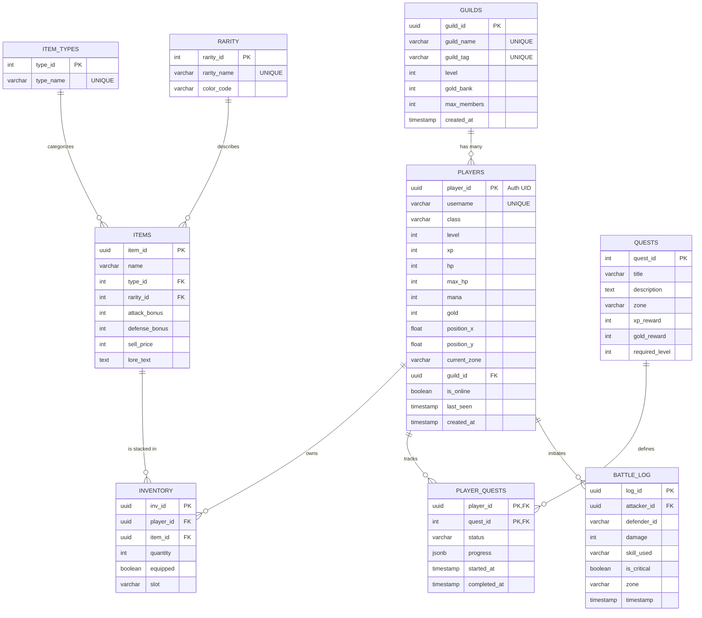

# FINAL PROJECT REPORT: REALM OF ASHENVEIL

---

## 1. Introduction
**Realm of Ashenveil** is a browser-based, massively multiplayer 2D role-playing game (MMORPG) built entirely on modern web technologies. Designed with a retro top-down aesthetic, the game seamlessly blends classic RPG elements—such as turn-based combat, exploration, and leveling—with real-time cloud database synchronization. 

What makes *Realm of Ashenveil* unique is its transparent backend architecture. The game features an integrated "DBMS Mode" which acts as an educational overlay, visually demonstrating the raw PostgreSQL transactions happening in real-time as players move, attack, trade, and interact with the game world.

---

## 2. Objectives
The primary objectives of this project are:
1. **Interactive Gameplay:** To deliver a fully functional 2D RPG experience, including class selection, stat scaling, turn-based monster battles, and quest tracking.
2. **Real-time Multiplayer Synchronization:** To achieve low-latency state synchronization across multiple clients, allowing players to see each other's movements and engage in direct Player vs. Player (PvP) combat.
3. **Database Transparency & Education:** To expose the underlying database operations (SQL `INSERT`, `UPDATE`, `SELECT`) to the player in real-time, bridging the gap between front-end gaming and back-end data engineering.
4. **Cross-Platform Accessibility:** To ensure the game is fully responsive and playable across both desktop browsers and mobile touch-devices (via virtual joysticks) without requiring software installation.

---

## 3. Application & Features
The application serves as both a fully playable game and an interactive demonstration of modern cloud-database capabilities.

### Key Use Cases & Mechanics:
*   **Player Progression:** Players can choose distinct classes (Warrior, Mage, Ranger, Rogue, Paladin), defeat enemies to earn XP, and level up to dynamically increase their Health, Mana, Attack, and Defense stats.
*   **Turn-Based Combat (PvE & PvP):** A robust battle engine where players can fight AI monsters or challenge other live players to duels. The system handles ability cooldowns, resource costs (Mana/Stamina), critical hits, and evasions.
*   **Guild Management:** Players can form guilds, pool their gold into a shared guild bank, and view real-time member rosters.
*   **Dynamic Marketplace:** An interactive shop system where players can spend earned gold on weapons, armor, and potions.
*   **Live DBMS Terminal:** A specialized toggleable UI that displays the actual SQL queries being executed on the Supabase backend during game events (e.g., viewing an `UPDATE players SET hp = ...` query trigger when taking damage).

---

## 4. Relational Schema & ER Diagram
The backend is powered by a PostgreSQL database managed via Supabase. The database architecture strictly adheres to **Third Normal Form (3NF)** to ensure data integrity, eliminate redundancy, and efficiently resolve many-to-many relationships through junction tables.

### 4.1. Entity-Relationship Diagram

### 4.2. Schema Design Notes
*   **UUIDs for Security:** The database extensively uses Universally Unique Identifiers (UUIDs) for primary keys, specifically tying `player_id` to Supabase Authentication tokens to secure Row Level Security (RLS) policies.
*   **Junction Tables:** The `INVENTORY` and `PLAYER_QUESTS` tables act as necessary mapping tables to resolve Many-to-Many relationships without duplicating core player or item data.
*   **Lookup Normalization:** Repeating strings like "Weapon" or "Legendary" are broken out into `ITEM_TYPES` and `RARITY` tables, meaning the massive `ITEMS` table only needs to store lightweight integer references (Foreign Keys).
